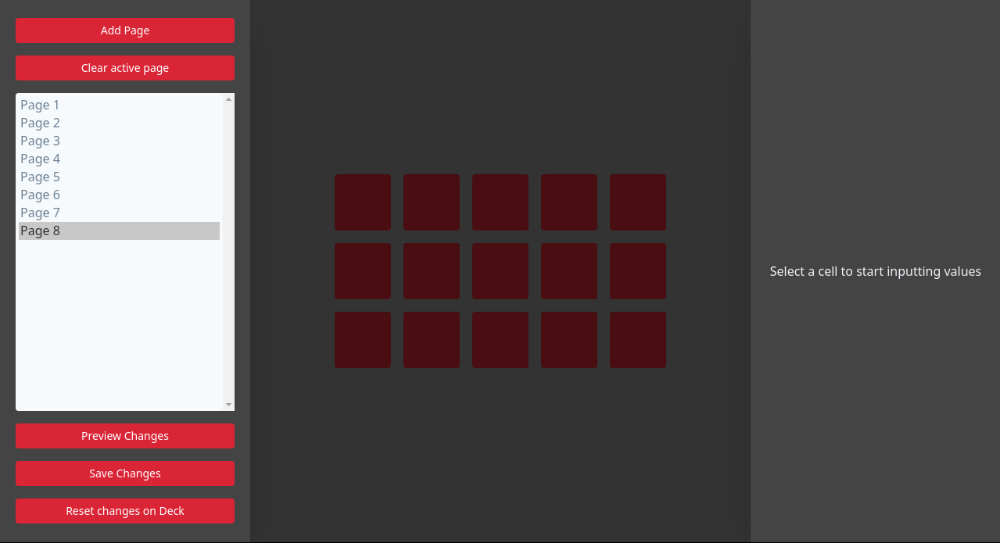

# Streamdeck Editor
## An Editor for [Streamdeckd](https://github.com/the-jonsey/streamdeckd)

### Installation

You need streamdeckd installed to use this, install by running:

`sudo npm install -g streamdeckd`

Then to install Streamdeck Editor, download the AppImage from releases, then run it.

### Usage

Make sure the daemon is running, by running `streamdeckd`, then run the editor by running the AppImage.

Below is an image of the editor:

#### Left Pane

The left pane is the list of pages in the config, you toggle between the pages by clicking on one,
you can also add a page and clear the current active page with the buttons at the top, as well as that there are controls for:
- Preview: Previews the config on the StreamDeck
- Save: Saves the config to disk
- Reset: Resets the config on the StreamDeck from the disk

#### Table in center 

The table in the center is a representation of the streamdeck interface, if you click on one of the "buttons",
it will get a red border, which activates the controls in the right pane, which target the current active "button".

#### Right Pane

The right pane is made up of the inputs to define the look and behaviour of a "button", the inputs on that pane are:

- Select box for icons/key handlers, these can have their own inputs, the default ones are:
    - Choose icon - choose the icon to be the background image for that "button" on that page.
    - Remove icon - remove the icon from the "button".
    - Text - Set the text to be superimposed over the image, if no image is specified, it will just display the text.

- `command`: runs a native shell command, something like `notify-send "Hello World"`.
- `keybind`: simulates the indicated keybind via xdtotool.
- `url`: opens a url in your default browser via xdg.
- `switch_page`: to switch the active page to the indicated page.
- `brightness`: to set the brightness of the streamdeck as a percentage.
- `write`: write out a provided string via xdotool.

### Thanks to:

- [Ben](https://www.github.com/UniBen) - for the design of the editor
- [cassidoo](https://twitter.com/cassidoo) - for the help with React and Electron
